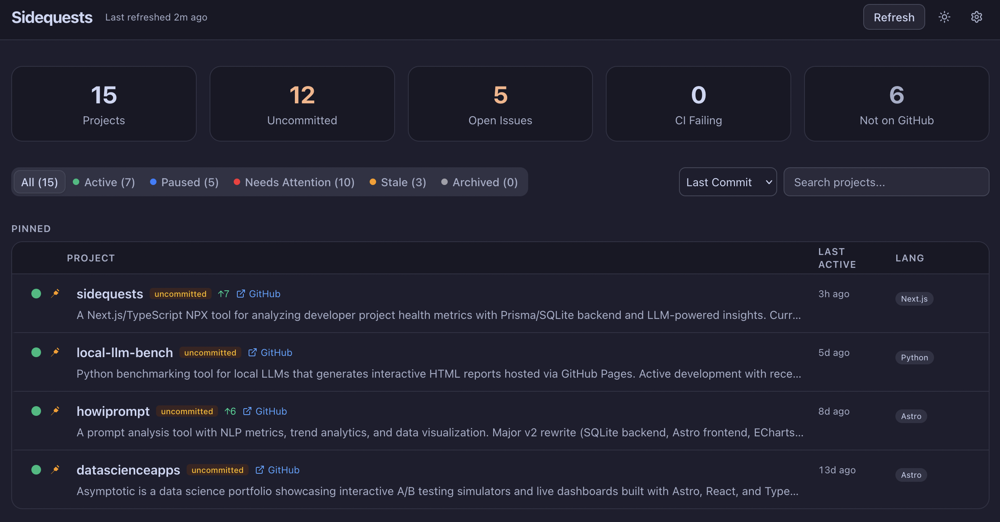
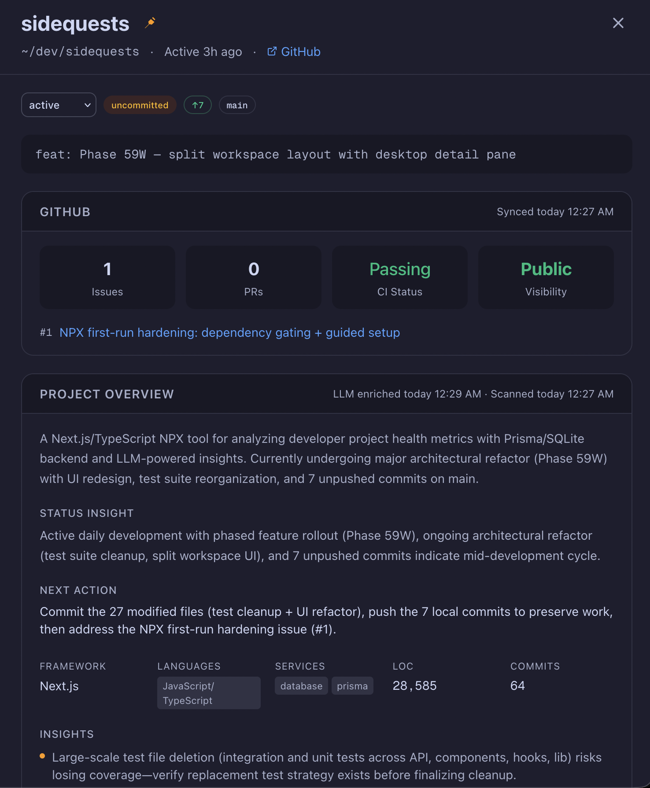

<div align="center">

# sidequests

**Track all your side projects — health, status, and AI summaries — completely hands-off.**

[](https://github.com/eeshansrivastava89/sidequests/actions/workflows/ci.yml)
[](https://www.npmjs.com/package/@eeshans/sidequests)
[](LICENSE)
[](package.json)

</div>

<br>

<p align="center">
  
</p>

<p align="center">
  
</p>

<br>

## Get started

```bash
npx @eeshans/sidequests
```

That's it. No install, no config files, no accounts. The onboarding wizard handles the rest.

**Requirements:** Node.js 20.9+ and git.

## What it does

Sidequests scans your dev directory, discovers every git repo, and builds a dashboard with:

- **Health scores** — hygiene (README, tests, CI, linter) + momentum (commit recency, clean tree, pushed up)
- **Status tracking** — active, paused, stale, or archived based on commit history
- **Git status at a glance** — dirty files, unpushed commits, current branch
- **AI enrichment** — optional LLM-powered summaries, tags, and recommendations

Everything runs locally. Your code never leaves your machine.

## Features

| | |
|---|---|
| **Scan & Score** | Auto-discovers repos, computes health/hygiene/momentum scores |
| **Smart Status** | Classifies projects as active, paused, stale, or archived |
| **Git Aware** | Dirty state, ahead/behind, branch tracking |
| **LLM Enrichment** | Generate summaries and recommendations with 5 providers |
| **Live Refresh** | SSE-based streaming progress as projects are scanned |
| **Pin & Override** | Pin favorites, manually override any metadata |
| **Dark Mode** | Automatic or manual theme switching |
| **Onboarding Wizard** | First-run setup that walks you through configuration |

## LLM providers

AI enrichment is optional — enable it in Settings and pick a provider:

| Provider | What you need |
|---|---|
| **Claude CLI** | [Claude CLI](https://docs.anthropic.com/en/docs/claude-cli) installed and authenticated |
| **Codex CLI** | [Codex CLI](https://github.com/openai/codex) installed, "Allow Unsafe" enabled |
| **OpenRouter** | API key |
| **Ollama** | Ollama running locally |
| **MLX** | mlx-lm-server running locally |

## CLI options

```
npx @eeshans/sidequests [options]

--port <n>    Use a specific port (default: auto)
--no-open     Don't open the browser
--help        Show help
--version     Show version
```

## Troubleshooting

| Problem | Fix |
|---|---|
| "git not found" in preflight | Install git — `brew install git` or [git-scm.com](https://git-scm.com) |
| Scan finds 0 projects | Make sure Dev Root points to a folder containing git repos |
| LLM enrichment fails | Check provider config in Settings, make sure API key or CLI is set up |
| Database errors | Delete `~/.sidequests/dev.db` and restart |

---

## Contributing

```bash
git clone https://github.com/eeshansrivastava89/sidequests.git
cd sidequests
npm install
npm run setup    # creates DB + default settings
npm run dev      # http://localhost:3000
```

See [CONTRIBUTING.md](CONTRIBUTING.md) for full guidelines.

### Scripts

| Command | Description |
|---|---|
| `npm run dev` | Dev server |
| `npm test` | Unit tests (Vitest) |
| `npm run test:integration` | Integration tests |
| `npm run build:npx` | Build standalone bundle |

### Architecture

```
~/dev repos ➜ scan ➜ derive ➜ pipeline ➜ SQLite ➜ API ➜ dashboard
```

Built with Next.js 16, Prisma 7 + SQLite, React 19, shadcn/ui, and Tailwind CSS.

## License

[MIT](LICENSE)
