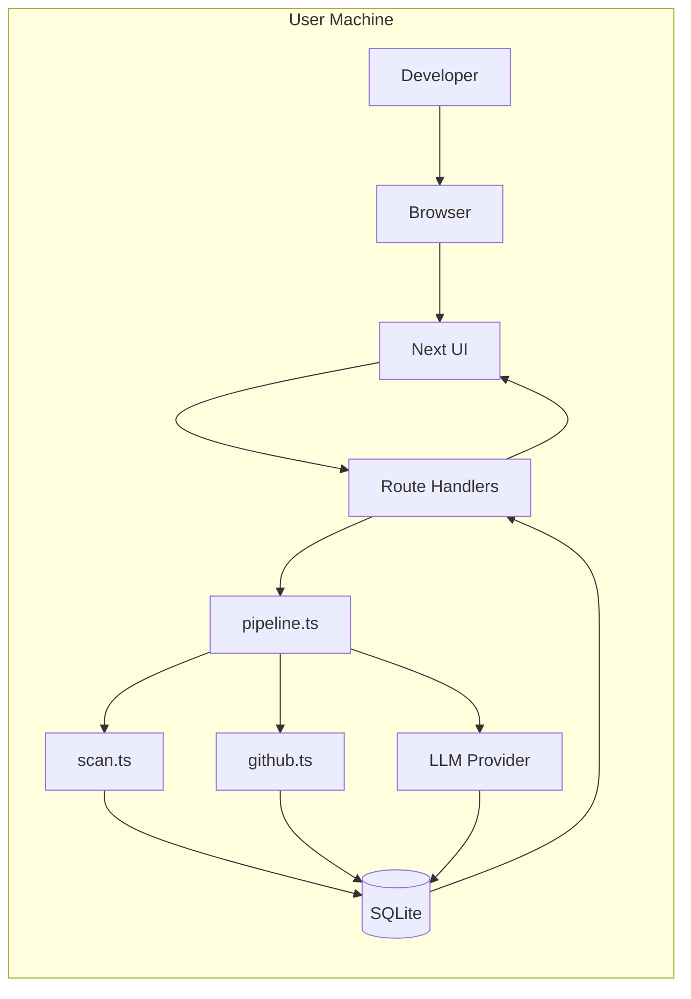
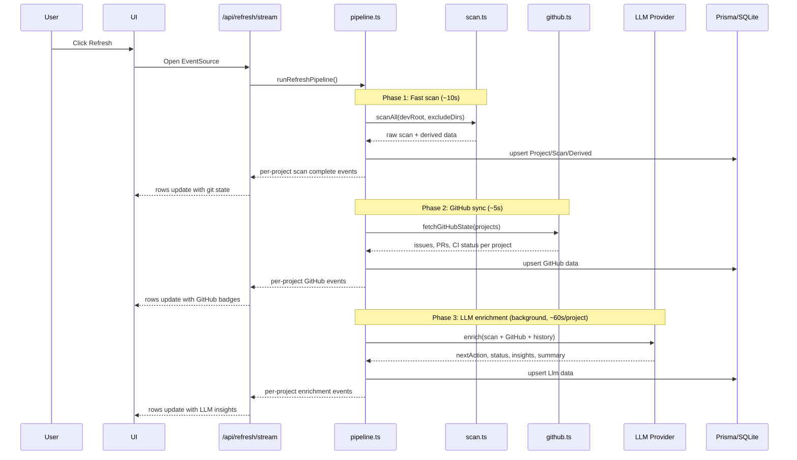
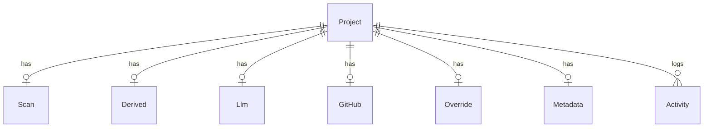
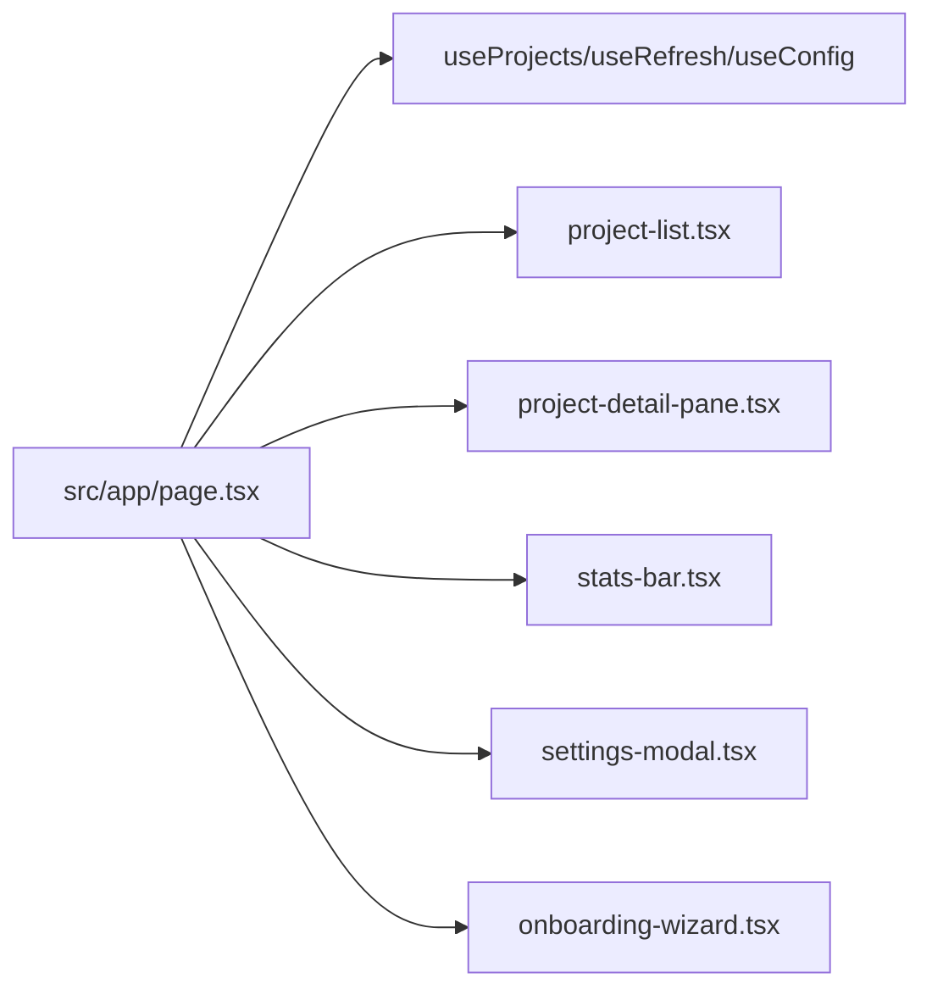
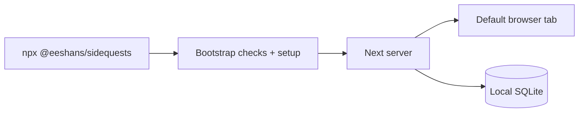

# Sidequests — Architecture

## Tech Stack

| Layer | Technology |
|-------|------------|
| App Framework | Next.js 16 (App Router), React 19 |
| Language | TypeScript 5 (strict) |
| Styling | Tailwind CSS v4 + shadcn/ui |
| Storage | SQLite via Prisma 7 + LibSQL adapter |
| Pipeline | TypeScript-native scan → GitHub sync → LLM enrichment |
| LLM | Provider abstraction with 5 adapters (claude-cli, openrouter, ollama, mlx, codex-cli) |
| GitHub | `gh` CLI for issues, PRs, CI status (read-only) |
| Testing | Vitest (unit + integration) |

## Architecture Overview



## Data Flow — Unified Refresh



Key design: Fast scan and GitHub sync complete quickly and update the UI immediately. LLM enrichment runs in background and streams results per-project as each completes.

## Domain Model



### New: GitHub Model

Stores read-only GitHub state per project:
- `openIssues` (count), `issuesJson` (top issue titles)
- `openPrs` (count), `prsJson` (top PR titles)
- `ciStatus` (success/failure/pending/none), `lastCiRun` (timestamp)
- `repoVisibility` (public/private/not-on-github)

### Updated: Llm Model

Core output fields:
- `nextAction` — primary display field on each project row
- `status` — LLM-derived phase (building/shipping/maintaining/blocked/stale/idea)
- `statusReason` — why the LLM chose that status
- `insights` — consolidated observations (concern + action in each bullet)
- `summary` — stable one-sentence description
- `tags` — descriptive tags
- `framework` — primary framework (e.g. "Next.js", "Astro") — LLM-sourced
- `primaryLanguage` — dominant language (e.g. "TypeScript", "Python") — LLM-sourced

Deprecated fields (kept in schema, no longer populated):
- `pitch`, `aiInsightJson`, `purpose`, `risksJson`, `recommendationsJson`

### Merge Priority

Priority varies by field type:

| Field | Priority (highest → lowest) |
|---|---|
| **status** | Override > Derived > "archived" |
| **summary** | Override > LLM > Legacy LLM > Scan description |
| **nextAction** | Metadata > LLM |
| **tags** | Override > LLM > Derived |
| **scores** | Derived only (hygiene, momentum, health) |
| **git state** | Derived > Scan (isDirty, ahead, behind) |

General rule: Override > Metadata > LLM > Derived > Scan, but not every field uses every layer. Derived data feeds into LLM context. `llmStatus` is a separate semantic field (e.g., "active-development"), distinct from the derived `status` classification ("active"/"paused"/"stale"/"archived").

## Pipeline Details

### `scan.ts` (deterministic)

Collects raw per-project facts:
- git state (dirty/ahead/behind/commits/branches/stash)
- language indicators (feed into LLM context; framework detection moved to LLM)
- file and hygiene signals (README, tests, CI config, linter, license)
- CI/deploy config file indicators
- TODO/FIXME and LOC estimate
- package manager and service hints

### `github.ts` (new — read-only GitHub sync)

Pulls state via `gh` CLI for projects with a remote URL:
- Open issues (count + top 3 titles)
- Open PRs (count + titles)
- Last CI workflow run status
- Graceful fallback: no remote or `gh` not authed → null values

### `derive.ts` (deterministic)

Computes baseline outputs:
- `statusAuto`: active/paused/stale/archived (days-since-commit)
- `hygieneScoreAuto` and `momentumScoreAuto`
- `healthScoreAuto = round(0.65*hygiene + 0.35*momentum)`
- Tags and score breakdown

Note: These feed into LLM context but are not the primary display. The derived `status` field (active/paused/stale/archived) is the canonical project status. `llmStatus` is a separate semantic field displayed alongside it (see Merge Priority above).

### LLM Enrichment

Receives: scan data + GitHub state + derived metrics + previous analysis
Returns: nextAction, status, statusReason, insights, summary, tags, framework, primaryLanguage

The LLM prompt is designed to produce actionable, context-aware output:
- "Fix failing CI on main" not "low hygiene score"
- "building" because "active feature work on feat/auth with 3 open issues" not "active" because "committed 2 days ago"

### `pipeline.ts` (orchestration)

Two-pass refresh pipeline:

**Pass 1 — Fast scan (all projects):**
1. Enumerate project directories, sort by lastTouchedAt
2. Per-project: scan → derive → store → GitHub fetch
3. Emit `project_complete(store)` after each — UI updates immediately

**Pass 2 — LLM enrichment (sequential, most-recent-first):**
4. Re-sort by lastCommitDate from scan data
5. LLM enrich one-by-one, emit `project_complete(llm)` after each
6. Activity logging + cleanup

## API Surface

```mermaid
flowchart TD
  A[/api/projects] --> B[merged list with GitHub + LLM data]
  C[/api/projects/:id] --> D[single merged project]
  E[/api/projects/:id/override] --> F[manual overrides]
  I[/api/projects/:id/pin] --> J[pinning]
  K[/api/projects/:id/activity] --> L[timeline]
  M[/api/projects/:id/touch] --> N[lastTouched tracking]
  Q[/api/refresh/stream] --> R[unified scan+github+enrich SSE]
  S[/api/settings] --> T[read/write persisted settings]
  U[/api/preflight] --> V[dependency/provider/gh-auth checks]
```

## Frontend Architecture



### Project Row Layout (Grid)

```
[status dot] [pin] | [name] [uncommitted] [ahead] [GitHub]  | [last active] | [lang badge]
                   | [summary]                               |               |
```

Split workspace: project list on left, detail pane on right (mobile: full-screen sheet).

### Stats Cards

| Card | Signal |
|------|--------|
| Projects | Total count |
| Uncommitted | Dirty working trees |
| Open Issues | Total across all GitHub repos |
| CI Failing | Projects with failing CI |
| Not on GitHub | Projects missing a remote |

### Removed from UI
- Hygiene/momentum score columns (replaced by LLM next action)
- Scoring Methodology modal
- AI Insight section (score/confidence — replaced by LLM status + insights)
- Metadata fields display (goal, audience, successMetrics)

## Configuration Model

```text
settings.json > environment variables > hardcoded defaults
```

Primary settings:
- Scan scope (`devRoot`, `excludeDirs`)
- LLM provider + model configuration
- Safety controls (`llmAllowUnsafe`, `llmDebug`)
- Display (`sanitizePaths`)

## Distribution Architecture



- Single command entrypoint
- Local-only runtime, no cloud backend
- CI auto-publish via GitHub Actions OIDC trusted publishing

## Security Posture

- **Local-first** — no outbound data unless LLM provider configured
- **GitHub read-only** — uses `gh` CLI auth, never writes to GitHub
- **Path sanitization** — optional, strips user paths from API responses
- **Provider preflight** — validates connectivity before enrichment
- **Unsafe gate** — agentic providers require explicit opt-in
- **Privacy gate** — CI checks tarball for private data before publish
- **Build-path scrubbing** — removes machine paths from standalone bundle

---

<details>
<summary>Historical Architecture (v1 — pre-product-rethink)</summary>

The v1 architecture had the same core stack but key differences:

- **No GitHub integration** — only local git state
- **Scan and Enrich were separate actions** — two buttons, two flows
- **LLM was optional** — gated by provider config, not central
- **Merge priority:** Override > Metadata > Derived > LLM > Scan (Metadata ranked higher)
- **UI focused on scores** — hygiene/momentum columns, health score, scoring methodology modal
- **Metadata model** had product-management fields (goal, audience, successMetrics, publishTarget) populated only by LLM
- **AI Insight** section showed score/confidence/reasons — abstract rather than actionable
- **Separate refresh-panel.tsx** showed scan progress as an overlay list
- **methodology-modal.tsx** explained the scoring formula

The v2 rethink (Feb 2026) shifted from "observation dashboard with optional AI" to "LLM-first action recommender with GitHub awareness."
</details>
