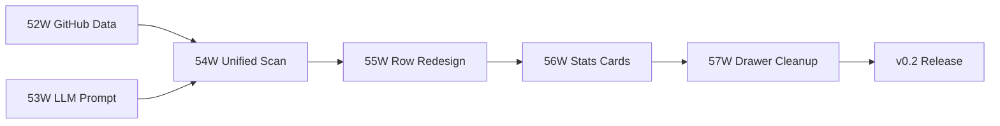

# Sidequests — Implementation Plan

## Status (2026-02-21)

- [Completed] v1 delivery (Phases 0-51W): infrastructure, scan pipeline, NPX distribution, first publish
- [Completed] Phase 52W: GitHub data collection (#001→#002)
- [Completed] Phase 53W: LLM prompt redesign (#003→#004)
- [Active] Phase 54W: Unified scan UX — next up

## v0.2 Vision

Transform Sidequests from an observation dashboard into a hands-off action recommender. LLM enrichment becomes the core value prop. GitHub state (issues, PRs, CI) is integrated. The UI shows what to DO, not what to SCORE.

Design principles:
1. LLM enrichment is the product — not optional, not secondary
2. Single view, single Refresh button — one page, one action
3. Hands-off — system figures everything out from code, git, GitHub, and LLM
4. Show actions, not metrics — replace scores with verbs

---

## Phase 52W — GitHub Data Collection ✓

**What:** Add read-only GitHub state to each project via `gh` CLI.
**Status:** Complete (reviewed #001→#002, approved 2026-02-21)

**Deliverables:**
- [x] New `src/lib/pipeline-native/github.ts` — fetches issues, PRs, CI status per project
- [x] New `GitHub` Prisma model (openIssues, openPrs, ciStatus, issuesJson, prsJson, repoVisibility)
- [x] Runtime migration via bootstrap-db.mjs (no Prisma migration file needed)
- [x] Preflight check for `gh` CLI auth status
- [x] Graceful fallback when no remote URL or `gh` not available
- [x] 18 unit tests for GitHub data collection

## Phase 53W — LLM Prompt Redesign ✓

**What:** Redesign LLM input/output to produce actionable next steps instead of abstract analysis.
**Status:** Complete (reviewed #003→#004, approved 2026-02-21)

**Deliverables:**
- [x] Richer LLM input: scan data + GitHub state + previous analysis
- [x] New output schema: `nextAction`, `status` (building/shipping/maintaining/blocked/stale/idea), `statusReason`, `risks[]`, `summary`, `tags[]`, `recommendations[]`
- [x] Deprecated from output: `pitch`, `aiInsight` (score/confidence), `purpose` (kept in schema for rollback)
- [x] Stopped populating: `goal`, `audience`, `successMetrics`, `publishTarget` (metadata write removed from pipeline)
- [x] Updated `LlmEnrichment` interface in `provider.ts`
- [x] Updated Llm Prisma model (5 new columns, old columns kept as deprecated)
- [x] Updated `merge.ts` merge logic (summary fallback chain, metadata.nextAction > llm.nextAction)
- [x] Rewrote prompt in `prompt.ts` with GitHub-aware context
- [x] 15 unit tests for new prompt parsing + buildPrompt

## Phase 54W — Unified Scan UX

**What:** Merge Scan + Enrich into a single "Refresh" action with per-row progress.

**Deliverables:**
- [ ] Single "Refresh" button replaces Scan + Enrich buttons
- [ ] Unified pipeline: fast scan → GitHub sync → stream results → LLM enrichment in background
- [ ] **Server-side pipeline mutex:** module-level lock in `/api/refresh/stream` — if a pipeline is already running, reject with 409 (or abort the old one). Prevents duplicate LLM calls from rapid clicks, tab refreshes, or reconnects. ~10 lines, no external deps.
- [ ] Per-row progress indicators (spinner during scan, sparkle during LLM enrichment)
- [ ] Rows update in-place as each project completes (no overlay list)
- [ ] Toast when all enrichment done, auto-dismiss progress
- [ ] Update `pipeline.ts` orchestration
- [ ] Update `/api/refresh/stream` SSE route
- [ ] Remove `refresh-panel.tsx` overlay

**Exit criteria:** One click does everything. Fast scan results appear in ~10s. LLM enrichment streams in background. No ugly progress list. Concurrent requests are rejected server-side — only one pipeline runs at a time.

## Phase 55W — Project List Row Redesign

**What:** Replace metric-heavy rows with two-line actionable layout.

**New row format:**
```
Line 1: [status dot] [name] [language] [git badges] [quick actions]
Line 2: [LLM next action] • [issues] • [PRs] • [CI status]
```

**Deliverables:**
- [ ] Redesign `project-list.tsx` with two-line row layout
- [ ] LLM next action as primary second-line text
- [ ] GitHub badges: issue count, PR count, CI status (✓/✗/○)
- [ ] Remove: hygiene column, momentum column, LOC column, days inactive column
- [ ] Keep: status dot (color from LLM status), name, language, git badges, quick actions
- [ ] Update `MergedProject` type in `types.ts`
- [ ] Responsive breakpoints for new layout

**Exit criteria:** Every project row shows what to DO next. GitHub state visible at a glance. No abstract scores on the list view.

## Phase 56W — Stats Cards + Header Redesign

**What:** Replace abstract stats with actionable signals.

**New cards:**
| Card | Signal |
|------|--------|
| Projects | Total count |
| Uncommitted | Dirty working trees |
| Open Issues | Total across all GitHub repos |
| CI Failing | Projects with failing CI |
| Not on GitHub | Projects missing a remote |

**Deliverables:**
- [ ] Update `stats-bar.tsx` with new card definitions
- [ ] Cards are clickable — filter project list to matching projects
- [ ] Remove "Scoring Methodology" button from header
- [ ] Remove `methodology-modal.tsx`

**Exit criteria:** Stats cards reflect signals the user actually acts on. Clicking a card filters the list.

## Phase 57W — Project Drawer Cleanup

**What:** Simplify drawer to match new data model.

**Deliverables:**
- [ ] **Summary** section: LLM summary (replaces Pitch)
- [ ] **Next Action + Risks** section: prominent, highlighted
- [ ] **GitHub** section: open issues list, open PRs list, CI status
- [ ] **Details** section: framework, languages, services, LOC (compact)
- [ ] **Timeline**: simplify to git commits + enrichment events
- [ ] Remove: hygiene/momentum score display, AI Insight section, metadata fields (goal/audience/successMetrics)
- [ ] Update `project-drawer.tsx`

**Exit criteria:** Drawer shows actionable info. No abstract scores. GitHub state integrated.

---

## Implementation Order

Phases 52W + 53W can run in parallel (both backend, no UI changes).
Phases 54W-57W are sequential (each builds on previous).



## Verification (v0.2)

1. `npm test` — all tests pass
2. `npm run test:integration` — integration tests pass
3. `npm run check:privacy` — privacy gate passes
4. Manual: `npm run dev` → click Refresh → fast scan results appear → GitHub data appears → LLM enrichment streams per-row → new row layout → drawer sections → stats cards filter
5. `npm run build:npx` → `npx @eeshans/sidequests` from clean dir works
6. User path demo: open dashboard → read one project row → know what to do next in <10s

---

<details>
<summary>Historical: v1 Implementation (Phases 0-51W)</summary>

**Completed phases:**
- Phases 0-40: Initial development (scan pipeline, Prisma storage, UI, LLM providers)
- Phases 41-44: Runtime and pipeline foundation
- Phases 45-46: Safety and onboarding baseline
- Phase 47W: NPX pivot direction lock + docs realignment
- Phase 48W: CLI launcher + NPX bootstrap (`bin/cli.mjs`, `bin/cli-helpers.mjs`)
- Phase 49W: Web/CLI QA gate (CI, bootstrap tests, CLI helper tests)
- Phase 50W: Electron deprecation + release transition
- Phase 51W: Pre-publish polish (toast system, attention UX, package rename to `@eeshans/sidequests`, model selection, preflight improvements)

**Post-51W fixes (pre-publish):**
- Prisma 7 hashed client packaging fix (#023-#026)
- FEATURE_LLM removal (#027-#028)
- Platform-aware build script (`scripts/build-npx.mjs`)
- OIDC trusted publishing workflow
- Privacy/security hardening (tarball content gate, build-path scrubbing)
- Data directory renamed to `~/.sidequests`
- CI + Publish merged into single workflow

**Key decisions:**
- Prisma bootstrap: Option A (pre-generated client + runtime CREATE TABLE IF NOT EXISTS)
- Distribution: npm with OIDC trusted publishing + provenance
- Release flow: `npm version patch && git push --tags`
</details>
