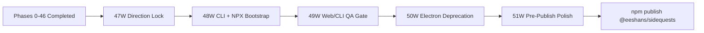

# Projects Dashboard v2 - Implementation Plan

This plan is the execution map from the current codebase to a web-first distribution model that runs through a single NPX command.

## Status (2026-02-20)

- [Completed] Historical delivery (Phases 0-40): completed
- [Completed] Runtime and pipeline foundation (Phases 41-44): completed
- [Completed] Safety and onboarding baseline (Phases 45-46): completed
- [Superseded] Desktop-first release track (legacy Phases 47-50): replaced by NPX/web pivot
- [Completed] Direction lock + docs realignment (Phase 47W): all deliverables checked
- [Completed] CLI launcher + NPX bootstrap (Phase 48W): all deliverables checked, approved in #008
- [Completed] QA/CI for web + CLI distribution (Phase 49W): approved in #010
- [Completed] Electron deprecation + release transition (Phase 50W)
- [Completed] Prisma 7 hashed client packaging fix (#023-#026)
- [Completed] FEATURE_LLM deprecation (#027-#028): LLM enrichment always-on, gated by provider config
- [Completed] Pre-publish polish (Phase 51W): toast system, attention UX, package rename, error handling

## Pivot Summary

The repository now has TS-native scan/derive, stable API routes, and onboarding UX that do not require Electron-specific runtime behavior. The remaining work is to ship and support the product as:

1. web server runtime
2. CLI launcher
3. single command entrypoint (`npx ...`)

## Carry-Forward Assets (Keep)

- Runtime boundary hardening (`APP_DATA_DIR`, settings/db path decoupling)
- TS-native scan/derive pipeline and parity fixtures
- Safety controls (`SANITIZE_PATHS`, `LLM_ALLOW_UNSAFE`)
- First-run onboarding wizard and diagnostics checks
- Setup bootstrap script and clean-clone validation flow

## Deprecation Scope (Planned)

- `desktop/` main-process shell and preload bridge
- Desktop packaging lane (`electron-builder.yml`, entitlements path, DMG workflow assumptions)
- Electron-specific smoke coverage and update plumbing
- Electron dependencies (`electron`, `electron-builder`, `electron-updater`)

## Web/NPX Roadmap

## Phase 47W - Direction Lock + Docs Realignment

What:
- Formally lock the distribution pivot to web/CLI NPX
- Align architecture and plan docs to current runtime truth

Deliverables:
- [x] Mark legacy desktop phases as historical/superseded in plan docs
- [x] Update architecture docs to TS-native scan/derive (remove Python-runtime wording)
- [x] Document explicit security tradeoff: keychain storage (desktop) vs `.env.local` (web/CLI)
- [x] Define NPX versioning policy (`@latest` default guidance + pinned-version guidance)

Exit Criteria:
- no conflicting "desktop is default" language in core internal docs
- pivot decision is explicit and reviewable from docs alone

## Phase 48W - CLI Launcher + NPX Bootstrap

What:
- Provide a published CLI entrypoint that starts the app with one command

How:
- add `bin` entry and launcher command (`projects-dashboard`)
- run prerequisite checks (Node, git)
- bootstrap first-run state (env + settings + db)
- start server on free port and open default browser
- support clean shutdown via SIGINT/SIGTERM

Deliverables:
- [x] `bin/` CLI with start command path suitable for NPX execution
- [x] runtime-safe DB bootstrap strategy for NPX users (no hidden dev-only assumptions)
- [x] browser auto-open behavior with opt-out flag
- [x] command help and troubleshooting output for common failures
- [x] package naming decided (`@eeshans/sidequests`)

Exit Criteria:
- user can run `npx <package>@latest` and reach dashboard in one session
- first-run bootstrap succeeds on clean machine with documented prerequisites

## Phase 49W - QA/CI for Web + CLI Distribution

What:
- replace desktop QA gates with web/CLI gates

Coverage targets:
- CLI launch and graceful termination
- first-run bootstrap behavior
- scan-only and enrich flows in web runtime
- settings persistence and secret handling expectations
- cross-platform smoke checks (macOS/Linux minimum)

Deliverables:
- [x] CI job for CLI launch smoke and API readiness checks (`.github/workflows/ci.yml`)
- [x] Bootstrap schema parity test (`bin/__tests__/bootstrap-db.test.ts` — 5 PRAGMA-based tests)
- [x] CLI helpers extraction + smoke tests (`bin/cli-helpers.mjs`, `bin/__tests__/cli-helpers.test.ts` — 16 tests)
- [x] Local validation gate (`validate:source-web` includes lint, test, integration, build:npx, privacy)
- [ ] clean-clone validation for NPX invocation path (partial — CI covers `npm ci` + full pipeline; `npm pack` + `npx` deferred to 50W)
- [ ] release-candidate signoff table for web/CLI acceptance criteria (deferred to 50W)

Exit Criteria:
- deterministic CLI/web smoke suite passes in CI ✓
- release candidate is signable without Electron-only checks ✓ (CI pipeline has no Electron dependencies)

## Phase 50W - Electron Deprecation + Release Transition

What:
- finalize migration from desktop-first repo shape to web/CLI release shape

How:
- remove or archive Electron runtime code
- prune Electron dependencies and scripts
- publish migration guidance for existing desktop users
- run final privacy gate against web/CLI artifacts

Deliverables:
- [x] desktop runtime either removed from mainline or moved to archived branch/tag
- [x] package scripts and dependencies reflect web/CLI source of truth
- [ ] migration notes published (desktop users -> web/CLI path)
- [x] final privacy/artifact gate passes for release bundle

Exit Criteria:
- main branch has no active Electron release dependency
- OSS onboarding path is one-command NPX plus optional source dev workflow

## Phase 51W - Pre-Publish Polish

What:
- Final UX and packaging fixes before first `npm publish` of `@eeshans/sidequests`

Deliverables:
- [x] Prisma 7 hashed client packaging fix (#023-#026)
- [x] @libsql/client hashed package + transitive deps fix (#024-#026)
- [x] Packaging smoke test (build → pack → install → start → preflight + DB endpoint)
- [x] FEATURE_LLM toggle removed (#027-#028) — LLM enrichment always-on, gated by provider
- [x] "Enrich with AI" button opens Settings when no provider configured
- [x] Toast notification system — Sonner, scan/enrich completion, status override (#030)
- [x] Attention reasons fully expanded in project drawer (#030)
- [x] Package name updated to `@eeshans/sidequests` across all refs (#030)
- [x] Scan error messages wrapped in user-friendly text with collapsible details (#030)
- [x] Preflight "Re-check" button in settings modal (#030)
- [x] Provider-specific help hints in preflight results (#030)

Exit Criteria:
- `npm pack` + install in clean dir + `npx @eeshans/sidequests` → dashboard loads, scan works, enrich button guides to config
- All user actions have visible feedback (toast or inline)
- 0 silent failures in the happy path

## Prisma Bootstrap Strategy (Decision Gate)

NPX distribution must not assume dev-only tooling is available at runtime. The current `setup.mjs` calls `npx prisma generate` and `npx prisma db push`, which rely on `prisma` being installed (currently a devDependency).

### Options

| Option | How | Pros | Cons |
|---|---|---|---|
| **A. Ship pre-generated client + use `@prisma/client` migrations API** | Run `prisma generate` at build/publish time. At runtime, use `@prisma/client` programmatic API or raw SQL to ensure schema exists. | No Prisma CLI needed at runtime. Smallest published package. | Requires a runtime migration shim (one-time `CREATE TABLE IF NOT EXISTS` for 7 tables). |
| **B. Move `prisma` to production dependencies** | Add `prisma` to `dependencies` (not just `devDependencies`). Keep current `npx prisma generate` + `npx prisma db push` flow. | Minimal code changes. Current setup.mjs works as-is. | Adds ~15MB to published package. `prisma generate` runs a binary download on first use. |
| **C. Bundle Prisma engines in published package** | Use `prisma generate` at publish time and include the query engine binary in `files`. Ship without the CLI. | Pre-built, no network fetch at runtime. | Platform-specific engine binaries increase package size per target OS. |

### Recommended Path

**Option A** (ship pre-generated client + runtime schema check). Rationale:

- The schema is stable (7 models, SQLite). A lightweight `CREATE TABLE IF NOT EXISTS` migration script is trivial and deterministic.
- Eliminates Prisma CLI as a runtime dependency entirely.
- Keeps the published package small and portable.
- `prisma generate` runs once at publish/build time, producing the client in `node_modules/.prisma/client/` which gets bundled in the standalone output.

Implemented in Phase 48W (`bin/bootstrap-db.mjs` — `CREATE TABLE IF NOT EXISTS` for all 7 models using `@libsql/client`).

## Publish Strategy (Decided)

- **Package name:** `@eeshans/sidequests`
- **Binary name:** `sidequests`
- **Install/run:** `npx @eeshans/sidequests` (or `npx @eeshans/sidequests@latest`)
- **Registry:** npmjs (default)
- **Versioning:** semver, starting at `0.1.0`

## Legacy Branch Strategy

To keep rollback safety while simplifying mainline:

- create and retain a desktop snapshot tag before deprecation cut
- preserve Electron artifacts/history in git, not in active runtime path
- document support policy (desktop lane frozen, web/CLI lane active)

## Visual Execution Map

## Schedule Model

- Aggressive track: ~2-3 weeks for docs + CLI + smoke gating
- Conservative track: ~4-5 weeks including migration hardening and cross-platform issues
- Timeline risk drivers: NPX bootstrap details, publish naming availability, and CI matrix reliability

## Acceptance Criteria (Current Pivot)

### Product
- dashboard behavior remains functionally equivalent to current API/UI semantics
- merge/scoring semantics unchanged unless explicitly versioned

### Onboarding
- first external user can launch with one NPX command and complete first scan in one session
- diagnostics and remediation remain visible in product

### Security
- secrets handling posture is explicitly documented for web/CLI mode
- unsafe provider execution remains explicit opt-in

### Distribution
- NPX/web launch path is reproducible from clean clone and from published package
- versioning/update semantics are explicit (`@latest` vs pinned)

### OSS Readiness
- docs are accurate, minimal, and testable from clean checkout
- contribution flow is web/CLI aligned with no desktop-only blockers

## Checkpoint Reviews

- Checkpoint A: after Phase 47W (direction lock + docs alignment) ✓
- Checkpoint B: after Phase 48W (CLI bootstrap working) ✓
- Checkpoint C: after Phase 49W (web/CLI quality gate green) ✓
- Checkpoint D: after Phase 50W (Electron deprecation finalized) ✓
- Checkpoint E: after Phase 51W (pre-publish polish + manual browser test)

At each checkpoint, run a user-path demo: `npx @eeshans/sidequests -> configure -> scan -> enrich` and capture regressions before advancing.
