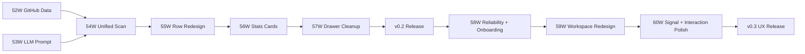

# Sidequests — Implementation Plan

## Status (2026-02-22)

- [Completed] v1 delivery (Phases 0-51W): infrastructure, scan pipeline, NPX distribution, first publish
- [Completed] Phase 52W: GitHub data collection (#001→#002)
- [Completed] Phase 53W: LLM prompt redesign (#003→#004)
- [Completed] Phase 54W: Unified scan UX (#005→#006→#007→#008)
- [Completed] Phase 55W: Project list row redesign (#009→#010)
- [Completed] Phase 56W: Stats cards + header redesign (#011→#012)
- [Completed] Phase 57W: Project drawer cleanup (#013→#014)
- [Completed] Phase 58W: Reliability + onboarding flow (#007→#015)
- [Completed] Phase 59W: Project workspace redesign (#017→#020)
- [Planned] v0.3 UX recovery remaining: phase 60W (signal clarity + interaction polish)

## v0.2 Vision

Transform Sidequests from an observation dashboard into a hands-off action recommender. LLM enrichment becomes the core value prop. GitHub state (issues, PRs, CI) is integrated. The UI shows what to DO, not what to SCORE.

Design principles:
1. LLM enrichment is the product — not optional, not secondary
2. Single view, single Refresh button — one page, one action
3. Hands-off — system figures everything out from code, git, GitHub, and LLM
4. Show actions, not metrics — replace scores with verbs

---

## Phase 52W — GitHub Data Collection ✓

**What:** Add read-only GitHub state to each project via `gh` CLI.
**Status:** Complete (reviewed #001→#002, approved 2026-02-21)

**Deliverables:**
- [x] New `src/lib/pipeline-native/github.ts` — fetches issues, PRs, CI status per project
- [x] New `GitHub` Prisma model (openIssues, openPrs, ciStatus, issuesJson, prsJson, repoVisibility)
- [x] Runtime migration via bootstrap-db.mjs (no Prisma migration file needed)
- [x] Preflight check for `gh` CLI auth status
- [x] Graceful fallback when no remote URL or `gh` not available
- [x] 18 unit tests for GitHub data collection

## Phase 53W — LLM Prompt Redesign ✓

**What:** Redesign LLM input/output to produce actionable next steps instead of abstract analysis.
**Status:** Complete (reviewed #003→#004, approved 2026-02-21)

**Deliverables:**
- [x] Richer LLM input: scan data + GitHub state + previous analysis
- [x] New output schema: `nextAction`, `status` (building/shipping/maintaining/blocked/stale/idea), `statusReason`, `risks[]`, `summary`, `tags[]`, `recommendations[]`
- [x] Deprecated from output: `pitch`, `aiInsight` (score/confidence), `purpose` (kept in schema for rollback)
- [x] Stopped populating: `goal`, `audience`, `successMetrics`, `publishTarget` (metadata write removed from pipeline)
- [x] Updated `LlmEnrichment` interface in `provider.ts`
- [x] Updated Llm Prisma model (5 new columns, old columns kept as deprecated)
- [x] Updated `merge.ts` merge logic (summary fallback chain, metadata.nextAction > llm.nextAction)
- [x] Rewrote prompt in `prompt.ts` with GitHub-aware context
- [x] 15 unit tests for new prompt parsing + buildPrompt

## Phase 54W — Unified Scan UX ✓

**What:** Merge Scan + Enrich into a single "Refresh" action with per-row progress.
**Status:** Complete (reviewed #005→#006→#007→#008, approved 2026-02-21)

**Deliverables:**
- [x] Single "Refresh" button replaces Scan + Enrich buttons
- [x] Unified pipeline: fast scan → GitHub sync → stream results → LLM enrichment in background
- [x] **Server-side pipeline mutex:** module-level lock in `/api/refresh/stream` with 409 rejection + timestamp-based staleness guard (10-min auto-recovery)
- [x] Per-row progress indicators (spinner during scan, sparkle during LLM enrichment)
- [x] Rows update in-place as each project completes (no overlay list)
- [x] Toast when all enrichment done, auto-dismiss progress
- [x] Update `pipeline.ts` orchestration
- [x] Update `/api/refresh/stream` SSE route (switched to fetch-based SSE for 409 handling)
- [x] Remove `refresh-panel.tsx` overlay

## Phase 55W — Project List Row Redesign ✓

**What:** Replace metric-heavy rows with two-line actionable layout.
**Status:** Complete (reviewed #009→#010, approved 2026-02-21)

**New row format:**
```
Line 1: [status dot] [name] [language] [git badges] [quick actions]
Line 2: [LLM next action] • [issues] • [PRs] • [CI status]
```

**Deliverables:**
- [x] Redesign `project-list.tsx` with two-line row layout
- [x] LLM next action as primary second-line text
- [x] GitHub badges: issue count, PR count, CI status (✓/✗/○)
- [x] Remove: hygiene column, momentum column, LOC column, days inactive column
- [x] Keep: status dot (color from LLM status), name, language, git badges, quick actions
- [ ] Update `MergedProject` type in `types.ts` — not needed (type already had fields from Phase 53W)
- [x] Responsive breakpoints for new layout (simplified grid, lang badge hidden on sm)

## Phase 56W — Stats Cards + Header Redesign ✓

**What:** Replace abstract stats with actionable signals.
**Status:** Complete (reviewed #011→#012, approved 2026-02-21)

**New cards:**
| Card | Signal |
|------|--------|
| Projects | Total count |
| Uncommitted | Dirty working trees |
| Open Issues | Total across all GitHub repos |
| CI Failing | Projects with failing CI |
| Not on GitHub | Projects missing a remote |

**Deliverables:**
- [x] Update `stats-bar.tsx` with new card definitions
- [x] Cards are clickable — filter project list to matching projects (with amber ring highlight + filter chip)
- [x] Remove "Scoring Methodology" button from header
- [x] Remove `methodology-modal.tsx`

## Phase 57W — Project Drawer Cleanup ✓

**What:** Simplify drawer to match new data model.
**Status:** Complete (reviewed #013→#014, approved 2026-02-21)

**Deliverables:**
- [x] **Summary** section: LLM summary with status badge + statusReason
- [x] **Next Action + Risks** section: prominent, with recommendations
- [x] **GitHub** section: issues/PRs/CI/visibility + top issues/PRs lists
- [x] **Details** section: collapsed by default, compact 4-column grid
- [x] **Timeline**: collapsed by default, paginated git commits + activity events
- [x] Remove: hygiene/momentum score display, AI Insight section, attention banner, notableFeatures, StructuredData
- [x] Update `project-drawer.tsx`

---

## v0.3 UX Recovery (3 phases total)

Goal: resolve the current real-world UX friction without a long rewrite. Keep implementation fast by using existing stack only: Tailwind + shadcn/ui + existing Radix primitives already in repo.

Constraints:
1. No net-new UI dependency unless absolutely required.
2. Prefer composition of existing components over custom abstractions.
3. Ship incrementally with user-visible value each phase.

## Phase 58W — Reliability + Onboarding Flow

**What:** Fix blocking/buggy first-run behavior and remove onboarding friction.
**Status:** Complete (reviewed #007→#015, approved 2026-02-22)

**Deliverables:**
- [x] Onboarding provider/model state is deterministic (no missing model dropdown on first provider selection)
- [x] First scan is two-stage in UI:
  1) deterministic scan + GitHub sync (fast)
  2) LLM enrichment continues in background
- [x] Onboarding Step 4 allows "Open Dashboard Now" immediately after stage (1), while stage (2) runs
- [x] Refresh cancel/restart handshake is robust (no stuck "in progress" toast loop after cancel)
- [x] Diagnostics UI shows required vs optional checks clearly
- [x] Onboarding modal spacing/typography tightened (less cramped, better scanability)

**Primary files:**
- `src/hooks/use-refresh.ts`
- `src/app/api/refresh/stream/route.ts`
- `src/components/onboarding-wizard.tsx`
- `src/components/settings-fields.tsx`
- `src/app/api/preflight/route.ts`

## Phase 59W — Project Workspace Redesign (Replace Current Modal UX)

**What:** Replace text-heavy modal with a more functional project workspace.
**Status:** Complete (reviewed #017→#020, approved 2026-02-22)

**Decision (lock for v0.3):**
- Use a **split workspace on the main page** (left project list rail + right project detail pane) instead of full-page route migration. This keeps scope smaller and faster than route-level rewrite.

**Deliverables:**
- [x] Project click opens persistent right detail pane (not centered modal)
- [x] GitHub block is top-priority in detail pane
- [x] Issues/PRs/CI actions are clickable (direct GitHub links)
- [x] Details section moved higher; all major sections expanded by default
- [x] Content density improved: less wall-of-text, more compact action rows/chips
- [x] Mobile behavior: pane becomes full-screen sheet with clear close/back affordance

**Primary files:**
- `src/app/page.tsx`
- `src/components/project-list.tsx`
- `src/components/project-drawer.tsx` (migrate to pane/sheet pattern)
- `src/components/ui/*` (reuse existing shadcn primitives)

## Phase 60W — Signal Clarity + Interaction Polish

**What:** Make status/filter semantics obvious and interaction model predictable.

**Deliverables:**
- [ ] Status color legend integrated into top filter tabs (dot colors match row status dots)
- [ ] Stats cards interaction consistency:
  - Projects card explicitly clears filters
  - active filter state is visually obvious
- [ ] "Needs Attention" and other status/filter chips have consistent color language
- [ ] Improve keyboard and focus behavior for list → detail interactions
- [ ] Add regression tests for:
  - cancel then refresh
  - first-scan unblock behavior
  - provider/model conditional rendering

**Primary files:**
- `src/app/page.tsx`
- `src/components/stats-bar.tsx`
- `src/components/project-list.tsx`
- `src/hooks/use-refresh.ts`
- `src/components/__tests__/onboarding-wizard.test.ts`
- `src/app/api/__tests__/refresh.integration.test.ts`

---

## Implementation Order

Phases 52W + 53W can run in parallel (both backend, no UI changes).
Phases 54W-57W are sequential (each builds on previous).
Phases 58W-60W are sequential and UX-focused.



## Verification (v0.2)

1. `npm test` — all tests pass
2. `npm run test:integration` — integration tests pass
3. `npm run check:privacy` — privacy gate passes
4. Manual: `npm run dev` → click Refresh → fast scan results appear → GitHub data appears → LLM enrichment streams per-row → new row layout → drawer sections → stats cards filter
5. `npm run build:npx` → `npx @eeshans/sidequests` from clean dir works
6. User path demo: open dashboard → read one project row → know what to do next in <10s

## Verification (v0.3 UX recovery)

1. Onboarding:
   - provider switch matrix works on first try (`claude-cli`, `codex-cli`, back to `claude-cli`)
   - first scan unblocks to dashboard right after deterministic phase
2. Refresh:
   - click Refresh → Cancel → Refresh again succeeds within 2 retries
3. Detail workspace:
   - GitHub actions (Issues/PRs/CI) are clickable
   - sections default expanded
   - mobile sheet behavior is usable
4. Signals:
   - status colors in tabs match row status dots
   - Projects card clears all signal filters
5. Quality gate:
   - `npm test`
   - `npm run test:integration`
   - `npm run build`

---

<details>
<summary>Historical: v1 Implementation (Phases 0-51W)</summary>

**Completed phases:**
- Phases 0-40: Initial development (scan pipeline, Prisma storage, UI, LLM providers)
- Phases 41-44: Runtime and pipeline foundation
- Phases 45-46: Safety and onboarding baseline
- Phase 47W: NPX pivot direction lock + docs realignment
- Phase 48W: CLI launcher + NPX bootstrap (`bin/cli.mjs`, `bin/cli-helpers.mjs`)
- Phase 49W: Web/CLI QA gate (CI, bootstrap tests, CLI helper tests)
- Phase 50W: Electron deprecation + release transition
- Phase 51W: Pre-publish polish (toast system, attention UX, package rename to `@eeshans/sidequests`, model selection, preflight improvements)

**Post-51W fixes (pre-publish):**
- Prisma 7 hashed client packaging fix (#023-#026)
- FEATURE_LLM removal (#027-#028)
- Platform-aware build script (`scripts/build-npx.mjs`)
- OIDC trusted publishing workflow
- Privacy/security hardening (tarball content gate, build-path scrubbing)
- Data directory renamed to `~/.sidequests`
- CI + Publish merged into single workflow

**Key decisions:**
- Prisma bootstrap: Option A (pre-generated client + runtime CREATE TABLE IF NOT EXISTS)
- Distribution: npm with OIDC trusted publishing + provenance
- Release flow: `npm version patch && git push --tags`
</details>
