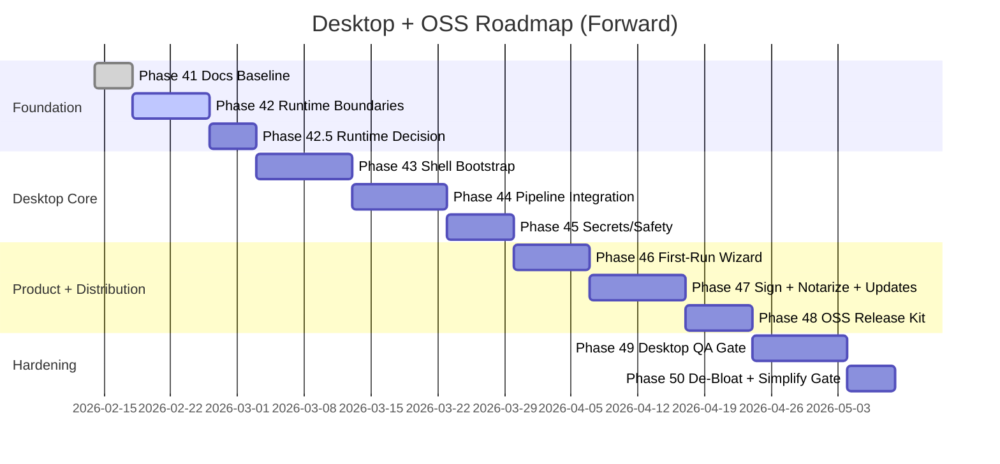

# Projects Dashboard v2 - Implementation Plan

This plan is the execution map from current local-web architecture to a standalone macOS desktop app that is open-source friendly and easy to onboard.

## Status (2026-02-15)

- [Completed] Historical delivery (Phases 0-40): completed
- [Completed] Test expansion delivered (unit + integration + pipeline checks)
- [Completed] Phases 42-44: Runtime boundaries, TS pipeline rewrite, Electron shell, pipeline integration
- [Completed] Phases 45-46: Secrets hardening + onboarding wizard
- [In Progress] Current focus: Phase 47 macOS distribution pipeline
- [Goal] Goal: `download -> configure -> run` on macOS with minimal friction


## Agent Team Strategy

Use parallel streams with strict file ownership:

| Stream | Ownership | Mission |
|-------|-----------|---------|
| Runtime/Core | `src/lib`, `src/app/api`, `pipeline`, `prisma` | preserve behavior while decoupling host assumptions |
| Desktop Shell | `desktop/*` | app lifecycle, IPC, packaging, updates |
| Product UX | `src/components`, `src/app/page.tsx` | first-run onboarding, diagnostics, setup experience |
| Release/OSS | `.github/workflows`, root docs | signing/notarization pipeline, contributor-ready docs |

## Historical Log (Compressed)

### Phase Timeline Summary (Completed)

| Phase Group | Scope | Outcome |
|-------------|-------|---------|
| 0-10 | Foundation + deterministic pipeline + core UI | local scanning app shipped with merge model |
| 11-19 | Enhanced scan/derive/schema + compact list + pinning + optimizations | daily-driver UX and richer project signals |
| 20-23 | activity memory + review-driven hardening | stronger reliability and UX polish |
| 24-30 | deterministic UI alignment + drawer overhaul + delta model | clearer triage and state change visibility |
| 31-34 | score re-architecture + traceability + attention model | hygiene/momentum split and explainability |
| 35-40 | OSS readiness sweep | setup script, onboarding improvements, preflight checks, docs/governance hardening |
| Test Phase 1-2 | unit/integration expansion | broad TS + Python + API + merge + pipeline coverage |

### Historical Detail Reference

Legacy per-phase detail is preserved in git history and prior revisions of this file. This document now prioritizes forward execution.

## Current Baseline Snapshot

```mermaid
flowchart TD
  UI[Dashboard UI] --> API[Next API Routes]
  API --> PIPE[pipeline.ts]
  PIPE --> PY[scan.py + derive.py]
  PIPE --> DB[(SQLite/Prisma)]
  API --> CFG[/api/settings + /api/preflight]
```

Baseline capabilities already present:
- settings-first config model
- preflight diagnostics route
- SSE refresh with progress and deltas
- deterministic scoring + merge priorities
- optional LLM enrich with provider abstraction

## Desktop + OSS Roadmap (New)

## Phase 41 - Docs Baseline + Continuous Update Policy

What:
- Establish a minimum docs baseline for kickoff
- Adopt continuous doc updates per phase (not a one-time blocking sweep)

Deliverables:
- [x] Core docs baseline aligned enough to start implementation safely
- [x] "docs update required" checklist added to every phase checkpoint

Exit Criteria:
- no critical setup blockers in docs
- full final docs sweep deferred to Phase 48 (OSS Release Kit)

## Phase 42 - Runtime Boundary Hardening

What:
- Make all file/db/settings paths runtime-configurable for desktop host
- Eliminate repository-root assumptions for persistent state

How:
- centralize path resolution in one runtime module
- support app-data directory defaults

Deliverables:
- [x] app runs with DB/settings in host app-data path
- [x] scan pipeline still executes with same semantics

Exit Criteria:
- no writes required in repo root at runtime

## Phase 42.5 - Pipeline Runtime Decision Gate (TS Rewrite vs Python Sidecar)

What:
- Decide the runtime strategy before desktop-shell integration hardens

How:
- Build a focused spike to estimate TypeScript rewrite parity for `scan.py` and `derive.py`
- Compare against Python sidecar complexity for packaging/signing/notarization

Deliverables:
- [x] Create parity fixture set for `scan.py` and `derive.py` behavior
- [x] Define output-shape acceptance criteria (functional parity)
- [x] Define performance thresholds and measurement method
- [x] Produce decision memo selecting Path A (TypeScript-native) or Path B (Python sidecar fallback)

Exit Criteria:
- team-aligned decision with measurable criteria
- downstream phases updated to reflect chosen path

Decision: **Path A selected (TypeScript-native rewrite)** — approved CP-004 Review, 2026-02-14.

Sequencing note: TS pipeline rewrite (Track A) runs in parallel with Phase 43 shell bootstrap (Track B). Integration gate: both tracks must complete before Phase 44 sign-off.

## Phase 43 - Desktop Shell Bootstrap (Electron-first)

What:
- Add desktop shell with managed lifecycle for renderer + embedded app server

How:
- create `desktop/main` and `desktop/preload`
- secure IPC for only required actions

Deliverables:
- [x] Create `desktop/main` app lifecycle bootstrap
- [x] Create `desktop/preload` with minimal secure IPC surface
- [x] Run dashboard UI + API from packaged shell locally
- [x] Document startup/shutdown behavior and failure paths

Exit Criteria:
- user can run packaged app without terminal

## Phase 44 - Pipeline Runtime Integration (TypeScript-native — Path A)

What:
- Integrate the TypeScript-native pipeline (selected in Phase 42.5) into the desktop app

How:
- Wire TS scan/derive functions into pipeline.ts (replacing Python subprocess calls)
- Validate parity against fixtures and live baselines

Deliverables:
- [x] Integrate TS scan/derive into pipeline.ts refresh flow
- [x] Ensure runtime works on clean macOS without Python installed
- [x] Pass parity fixture tests against baseline outputs
- [x] Validate integration with preflight and refresh flow

Exit Criteria:
- preflight is green for pipeline runtime on fresh machine
- packaging path is stable for signing/notarization

## Phase 45 - Secrets + Safety Hardening

What:
- move provider secrets to OS-secure storage via Electron `safeStorage` API
- strip secrets from plaintext settings persistence
- migrate existing plaintext secrets on first desktop launch

How:
- `desktop/secrets.ts` — encrypt/decrypt using `safeStorage`, migration from settings.json
- Main process decrypts secrets and injects as env vars to forked server
- IPC bridge for renderer to set/delete/check secrets
- `writeSettings()` strips secret keys, API route skips persisting them

Deliverables:
- [x] Store provider secrets in OS-secure storage (`safeStorage` + `secrets.enc`)
- [x] Ensure plaintext key leakage is removed from persisted settings
- [x] IPC bridge for secret management (set/delete/has) from renderer
- [x] Auto-migration of plaintext secrets from settings.json on desktop startup
- [x] Add tests for secure read/write and migration behavior (11 new tests)

Exit Criteria:
- secret at-rest posture documented and verified

## Phase 46 - First-Run Desktop Onboarding

What:
- guided setup wizard in desktop context

Wizard steps:
1. choose dev root
2. run diagnostics
3. select provider and test
4. run first scan

Deliverables:
- [x] Implement guided setup flow (dev root -> diagnostics -> provider -> first scan)
- [x] Persist setup completion state
- [x] Provide actionable remediation for failed checks
- [x] Verify first-run flow on clean environment

Exit Criteria:
- new user can complete setup without external docs

## Phase 47 - macOS Distribution Pipeline

What:
- sign + notarize + produce DMG artifacts + enable desktop auto-updates

How:
- CI workflow with Apple credentials (secure secrets)
- release artifact verification
- update channel configuration and signed update metadata

Deliverables:
- [x] Configure CI signing + notarization workflow
- [x] Generate notarized DMG artifacts
- [x] Implement and test in-app auto-update path
- [ ] Validate install + update on clean macOS account

Exit Criteria:
- Gatekeeper accepts app without manual bypass
- update flow successfully delivers a newer build in test channel

## Phase 48 - OSS Release Kit

What:
- contributor and user launch readiness

Deliverables:
- [ ] Finalize README for desktop and dev workflows
- [ ] Publish troubleshooting matrix and support boundaries
- [ ] Add issue templates + release checklist
- [ ] Run clean-clone onboarding validation

Exit Criteria:
- first external user can install and run successfully

## Phase 49 - Quality Gate for Desktop

What:
- expand automated QA for packaged app behavior

Coverage targets:
- launch + onboarding
- scan-only and enrich flows
- settings persistence and migration
- path sanitization correctness
- failure-mode UX (missing provider, permission errors)

Deliverables:
- [ ] Add packaged-app smoke test suite in CI
- [ ] Validate launch/onboarding/scan/enrich/settings persistence flows
- [ ] Validate failure-mode UX (permissions/providers/runtime missing)
- [ ] Sign off release candidate against acceptance criteria

Exit Criteria:
- release candidate passes deterministic smoke suite

## Phase 50 - De-Bloat + Simplification Gate (YAGNI/DRY)

What:
- run a final architecture hygiene pass to remove dead code, redundancy, and non-essential runtime/package artifacts before public release

How:
- prune replaced/legacy paths now superseded by selected runtime architecture
- consolidate duplicate logic and config where a single source of truth is possible
- remove unused dependencies and verify no behavior regressions

Deliverables:
- [ ] Remove dead code and stale fallback paths that are no longer used
- [ ] Eliminate duplicate logic/config that violates DRY where safe to unify
- [ ] Remove unused dependencies and scripts (with lockfile refresh)
- [ ] Trim packaged artifact contents to runtime-essential files only
- [ ] Document intentional duplication that remains (if any) with rationale

Exit Criteria:
- no known dead code paths in active runtime
- no high-value duplicate logic left without explicit rationale
- packaged app footprint and runtime file set are intentionally minimal

## Future Consideration (Not Scheduled): Tauri Evaluation

- Keep as an unscheduled architecture option after Electron production learnings.
- Re-evaluate only if footprint/security constraints justify migration cost.

## Visual Execution Map



## Schedule Model

- Aggressive track (if TS rewrite parity is achieved in Phase 42.5): ~6-8 weeks to notarized beta.
- Conservative track (if Python sidecar fallback is chosen): ~8-10 weeks to notarized beta.
- Timeline includes risk buffer for packaging, signing, and first-run UX defects.
- Final public release gate includes Phase 50 simplification pass before broad launch.

## Acceptance Criteria (Current)

### Product
- Dashboard remains functionally equivalent in desktop mode
- Existing merge/scoring semantics unchanged unless explicitly versioned

### Onboarding
- New mac user can install app and complete first scan within one session
- Diagnostics and remediation are visible in-product

### Security
- Sensitive provider credentials stored securely
- Unsafe execution paths remain explicit opt-in

### Distribution
- Signed + notarized macOS builds are reproducible in CI
- Release artifacts and checksums are published with notes

### OSS Readiness
- Docs are accurate, minimal, and testable from clean checkout
- Contribution and issue flows are explicit and low-friction

## Checkpoint Reviews

- Checkpoint A: after Phase 42 (runtime boundary complete)
- Checkpoint B: after Phase 42.5 (runtime strategy decision complete)
- Checkpoint C: after Phase 44 (pipeline integration validated)
- Checkpoint D: after Phase 47 (first notarized install)
- Checkpoint E: after Phase 49 (desktop quality gate green)
- Checkpoint F: after Phase 50 (de-bloat/simplification gate complete)

At each checkpoint, run a user-path demo: `install/open/configure/scan/enrich` and capture regressions before advancing.
